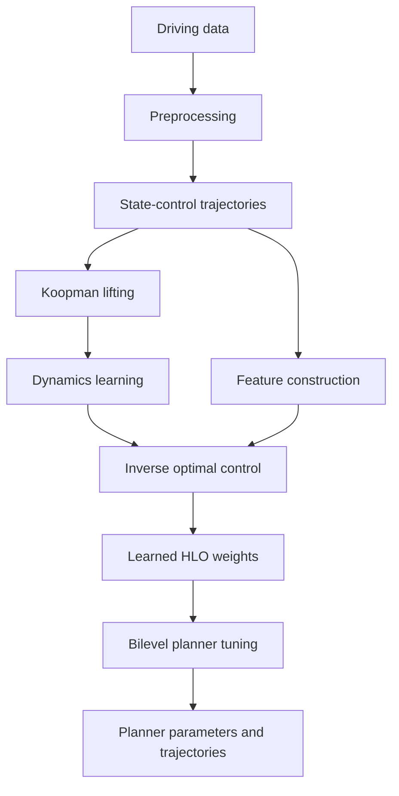

# Data-Driven Inverse Optimal Control for ADAS Trajectory Planning

Research code for a master's thesis on data-driven inverse optimal control for lane-change and trajectory-planning behavior. The repository focuses on learning high-level objectives from demonstrations, fitting dynamics models, and comparing a data-driven IOC pipeline against a classical IOC baseline.

This public version is scoped to the standalone research components: model learning, bilevel optimization, synthetic validation, and benchmark comparisons.

## Highlights

- data-driven IOC pipeline with learned dynamics and learned high-level objective weights
- classical IOC benchmark for side-by-side comparison
- synthetic validation scripts and figure generation for qualitative inspection
- modular planner-tuning utilities for bilevel experiments

## Why this project matters

The core thesis question is whether lane-change behavior can be explained and reused through a learned high-level objective rather than only through hand-tuned cost functions. In this repository, that question is explored through:

- trajectory feature design for inverse optimal control
- Koopman-style dynamics learning with polynomial and neural lifts
- bilevel planner tuning against learned objective weights
- comparison against a classical linear IOC baseline

This makes the repository useful both as thesis evidence and as a concrete portfolio project for controls, autonomy, and machine-learning interviews.

## Method overview

The public workflow starts from driving demonstrations, converts them into train/test trajectory segments and reference-aware features, then learns both a Koopman-style dynamics model and shared high-level objective weights. Those learned artifacts support downstream planner tuning, while separate validation and a classical IOC baseline provide comparison points that are already implemented in the repository.



- **Koopman lifting:** polynomial or neural lifting of the vehicle state.
- **Dynamics learning:** identification of a linear surrogate model in the lifted space.
- **Feature construction:** calculation of interpretable trajectory features used by inverse optimal control.
- **HLO:** the learned high-level objective representing inferred driving preferences.
- **Planner output:** optimized QP cost parameters and their resulting trajectories.

### Inputs and outputs

- Input demonstrations: merged or synthetic driving trajectories are loaded, normalized, split into train/test sets, and segmented for learning workflows.
- Learned dynamics representation: the DDIOC pipeline fits Koopman matrices and either a polynomial lift or a DNN lift for trajectory rollouts.
- Learned high-level objective weights: the HLO learner estimates shared objective weights from the segmented demonstrations and learned dynamics.
- Planner output: bilevel planner tuning produces optimized trajectories under the learned objective.
- Evaluation outputs: held-out dynamics metrics, trajectory overlays, and classical-IOC comparison artifacts are written under the repository's output and figure directories.

## What is in the public repo

- research code for objective learning, dynamics learning, and planner tuning
- synthetic validation and benchmark scripts that run without proprietary datasets
- curated figures under `docs/figures/` for quick qualitative inspection
- a standalone end-to-end synthetic IOC example under `examples/`

## Current evidence

The included synthetic validation workflow in `ioc/DDIOC/validate_dnn.py` compares polynomial and neural Koopman lifts on held-out trajectories. In the current public run, the DNN lift achieved lower one-step and rollout error than the polynomial lift, and the generated figures are kept under `docs/figures/`.

## Repository layout

- `cpp/`: C++ implementation with `src/`, `include/`, `tests/`, and its own `CMakeLists.txt`
- `python/`: Python implementation with `src/ioc/`, `tests/`, and `pyproject.toml`
- `examples/`: runnable public examples that showcase the thesis ideas end to end
- `docs/figures/`: curated public figures suitable for reports or a project page
- `outputs/`: local run artifacts generated during experiments
- `.github/workflows/`: CI definitions for both implementations

## Main components

`python/src/ioc/DDIOC/pipeline.py`
End-to-end learning pipeline for Koopman-style dynamics learning and shared high-level objective estimation.

`python/src/ioc/DDIOC/hlo_learning.py`
Utilities for learning, loading, and saving high-level objective weights.

`python/src/ioc/DDIOC/tune_qp_planner.py`
Bilevel optimization utilities for tuning planner parameters against a learned high-level objective. The script supports generic JSON-based planner parameter updates and optional external planner or MPC hooks.

`python/src/ioc/DDIOC/validate_dnn.py`
Synthetic validation script for comparing polynomial and neural Koopman lifts. Figures are written under `outputs/figures/validate_dnn/`.

`python/src/ioc/LIOC/linear_ioc_bilevel.py`
Classical bilevel IOC benchmark for comparison against the data-driven method.

`examples/synthetic_ioc_demo.py`
Standalone synthetic demonstration of learned HLO recovery, LQR planner tuning, and comparison against a classical IOC-style baseline.

## Quick start

Create a local environment and install dependencies:

```bash
python3 -m venv .venv
source .venv/bin/activate
python3 -m pip install -e ./python
python3 -m pip install -r requirements.txt
```

Typical entry points:

```bash
export PYTHONPATH=python/src
python3 -m ioc.DDIOC.pipeline --help
python3 -m ioc.DDIOC.tune_qp_planner --help
python3 -m ioc.LIOC.linear_ioc_bilevel --help
python3 -m ioc.DDIOC.validate_dnn
python3 examples/synthetic_ioc_demo.py
```

## C++ port

The repository now includes a C++ implementation of the standalone synthetic IOC workflow and a C++ counterpart for the classical synthetic bilevel IOC benchmark. The current C++ surface targets the self-contained public examples: synthetic demonstration generation, high-level-objective recovery, LQR planner tuning, classical IOC-style tracking-weight fitting, baseline comparison, and JSON artifact export.

Build and run it with CMake:

```bash
cmake -S cpp -B build/cpp
cmake --build build/cpp -j4
./build/cpp/ddioc_synthetic_demo
./build/cpp/ddioc_lioc_benchmark
./build/cpp/ddioc_validate_dynamics
```

The synthetic demo executable writes its JSON output under `outputs/examples/synthetic_ioc_demo_cpp/`. The broader Python DDIOC stack under `python/src/ioc/DDIOC/` still contains capabilities that have not yet been ported to C++, especially the CasADi- and PyTorch-based learning paths and the merged-CSV data pipeline.

## Implementations

- [C++ version](./cpp) - optimized for performance
- [Python version](./python) - simpler and easier to experiment with

Core dependencies are listed in `requirements.txt`, including PyTorch for the DNN Koopman-lift workflow. Optional optimization workflows also use packages such as `cvxpy`, `scikit-optimize`, and `pymoo`.

## Suggested first look

- run `python3 -m ioc.DDIOC.validate_dnn` for a self-contained validation example
- run `python3 examples/synthetic_ioc_demo.py` for a compact end-to-end synthetic IOC example
- inspect `python/src/ioc/DDIOC/pipeline.py` for the end-to-end learning flow
- inspect `python/src/ioc/LIOC/linear_ioc_bilevel.py` for the classical benchmark formulation

## Public scope

- this repo contains the research core and standalone evaluation code
- it does not include non-public datasets, private preprocessing packages, or production planner binaries
- some dataset-extraction entry points expect optional helper modules to be supplied separately if that workflow is needed

## License

This repository is released under the MIT License. See `LICENSE`.

## Notes

- `outputs/` is intended for local run artifacts and is git-ignored by default.
- `docs/figures/` stores curated sample figures for reports or a project page.
- `examples/` contains runnable showcase scripts that are intended to be read by other engineers and researchers.